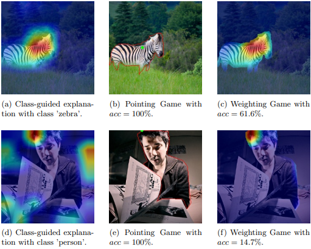

# The Weighting Game: Evaluating Quality of Explainability Methods

Standalone code for the paper: [The Weighting Game: Evaluating Quality of Explainability Methods](https://arxiv.org/abs/2208.06175) by [Lassi Raatikainen](https://www.linkedin.com/in/lassi-raatikainen/) and [Esa Rahtu](https://esa.rahtu.fi/).


## Abstract

The objective of this paper is to assess the quality of explanation heatmaps for image classification tasks. To assess the quality of explainability methods, we approach the task through the lens of accuracy and stability.

In this work, we make the following contributions. Firstly, we introduce the Weighting Game, which measures how much of a class-guided explanation is contained within the correct class' segmentation mask. Secondly, we introduce a metric for explanation stability, using zooming/panning transformations to measure differences between saliency maps with similar contents.

Quantitative experiments are produced, using these new metrics, to evaluate the quality of explanations provided by commonly used CAM methods. The quality of explanations is also contrasted between different model architectures, with findings highlighting the need to consider model architecture when choosing an explainability method.


## Software implementation

To run evaluations you need to either download a COCO finetuned model ([ResNet50](https://drive.google.com/file/d/1FDk7aFG8eSCfJbdYYynShmX5IPthFIqu/view?usp=sharing),[VGG16-BN](https://drive.google.com/file/d/19hQCAPb_fEzPjEU2KwM2hOXO7cb8pf_W/view?usp=sharing),[ViT-B/32](https://drive.google.com/file/d/1UfWPjD6Qp1ZJUk5-OJObkhRdgclQ0LZR/view?usp=sharing),[Swin-T](https://drive.google.com/file/d/1Dpw-wdpSC1ox0ByJAPGl9lpD5ddgrFNi/view?usp=sharing)) or train one using bash script

    bash ./scripts/finetune_models.sh

with modified parameters to suit the training procedure. The model then should be placed into the root folder of the repository. Downloading a model is recommended if desired model is found in the list.

To run results of the Weighting Game, modify the file measure_weighting_game.sh from scripts to suit desired model/method combination, alongside the correct paths to COCO validation images and annotations. After modifying the script, simply run it using:

    bash ./scripts/measure_weighting_game.sh

To run pan/zoom transformation stability for a method, do same process of changing script parameters found in measure_stability_transformation.sh and run it using:

    bash ./scripts/measure_stability_transformation.sh

To create 3D videos using [3D Ken Burns](https://github.com/sniklaus/3d-ken-burns) effect, simply change input and output directories found in create_3d_videos.sh and run it using:

    bash ./scripts/create_3d_videos.sh

Finally, to calculate video stability results, change parameters found in measure_stability_video.sh and run it using:

    bash ./scripts/measure_stability_video.sh

## Getting the code

You can download a copy of all the files in this repository by cloning the
[git](https://git-scm.com/) repository:

    git clone https://github.com/lassiraa/weighting-game.git


## Dependencies

You'll need a working Python (>=3.9) environment to run the code. The dependencies can be installed with pip using:

    pip install -r requirements.txt

Or with conda using:

    conda install --file requirements.txt

## Illustrations

Comparison of Weighting Game to [Pointing Game](https://arxiv.org/abs/1608.00507):



## Cite this work
If you use this code for your project please consider citing us:
```
@article{raatikainen2022weighting,
  author = {Raatikainen, Lassi and Rahtu, Esa},
  title = {The Weighting Game: Evaluating Quality of Explainability Methods},
  publisher = {arXiv},
  year = {2022},
  url = {https://arxiv.org/abs/2208.06175}
}
```